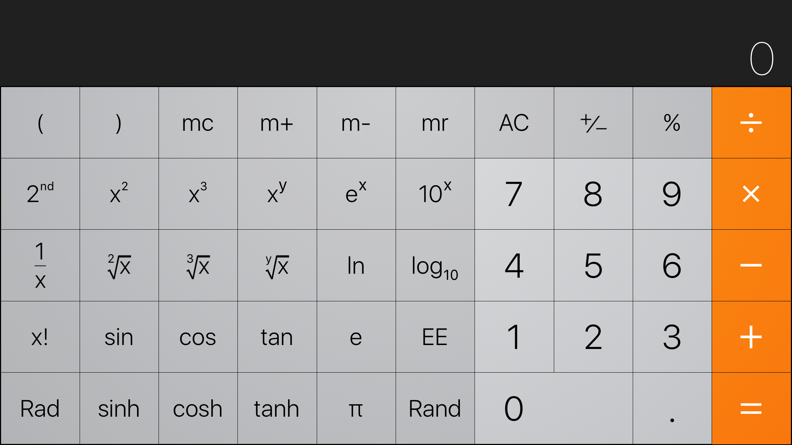
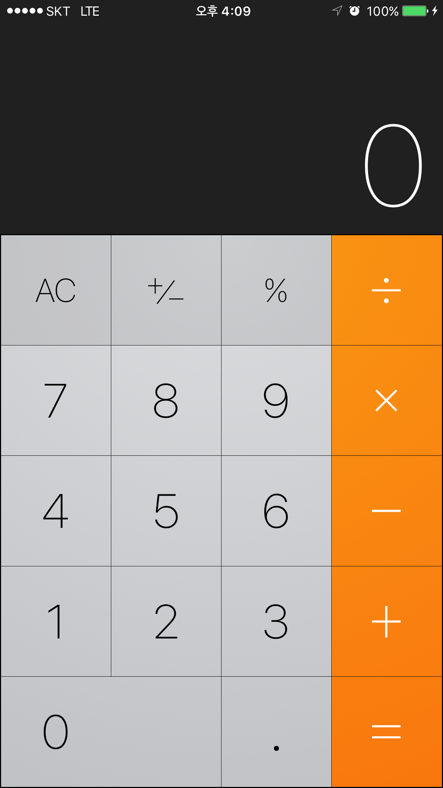

### iOS D조 쌍쌍바 모둠 과제
* 공통 과제
* 이번주 학습한 내용을 바탕으로 다른 모둠이 1시간 동안 해결할 수 있는 모둠학습 만들어오기

#### iOS 기본 계산기 만들기 (기능 적용 X)
* 학습한 오토 레이아웃을 이용하여 iOS 기본 계산기 앱과 동일한 화면 구성. 
* 스크린샷과 같이 기기가 회전해도 화면이 정상 출력되도록 구성
* 해결실마리
    * Size-Class-Specific Layout

